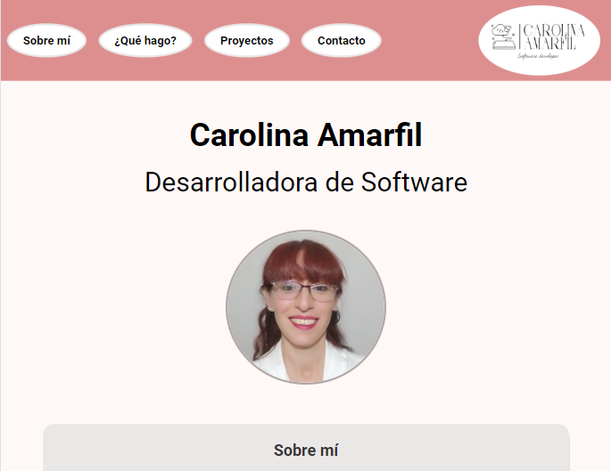

# Mi Portfolio

Este es mi portfolio personal donde presento mis proyectos y habilidades como desarrolladora de software. Aquí podrás encontrar información sobre los servicios que ofrezco, mis proyectos anteriores y cómo contactarme.

## Sobre mí
Soy Carolina Amarfil, una apasionada del desarrollo de software con experiencia en diversas tecnologías y lenguajes de programación. Me encanta aprender y enfrentar nuevos desafíos en el campo del desarrollo web y la ingeniería de software.

## Qué hago
- Desarrollo de aplicaciones web.
- Creación de interfaces de usuario intuitivas.
- Implementación de soluciones en la nube.

## Proyectos Destacados
En esta sección podrás visualizar un detalle de los proyectos que he ralizado hasta el momento

## Captura de Pantalla
Aquí hay una captura de pantalla de mi portfolio:

## Contacto
Puedes contactarme a través de [mi correo electrónico](caroamarfil@gmail.com).

